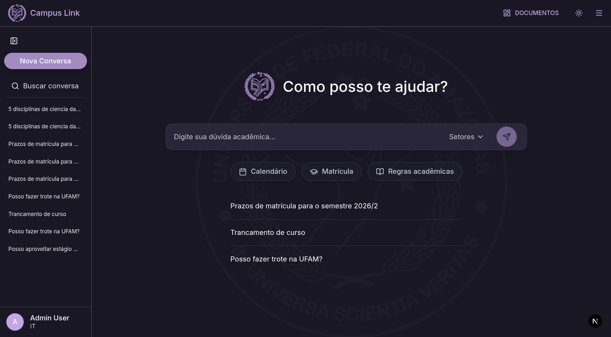
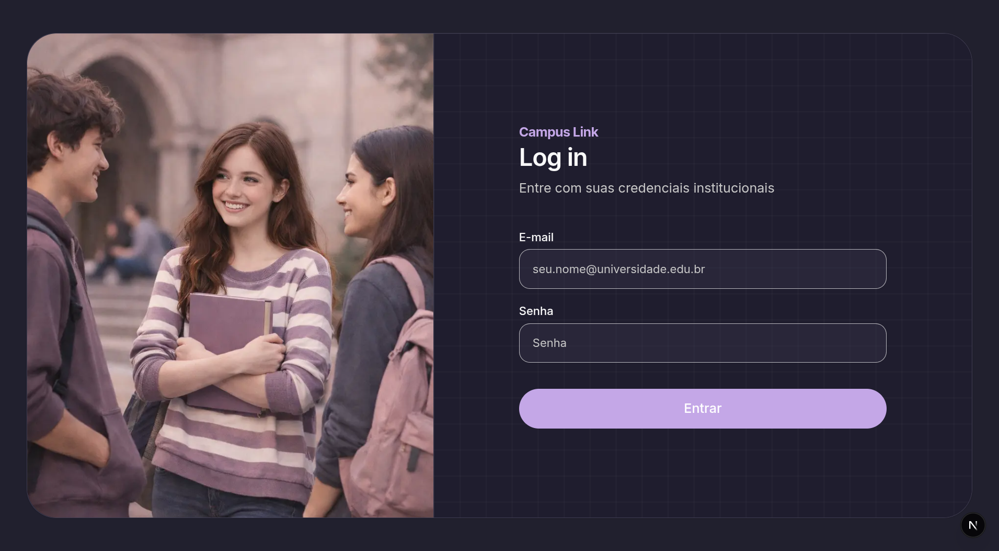
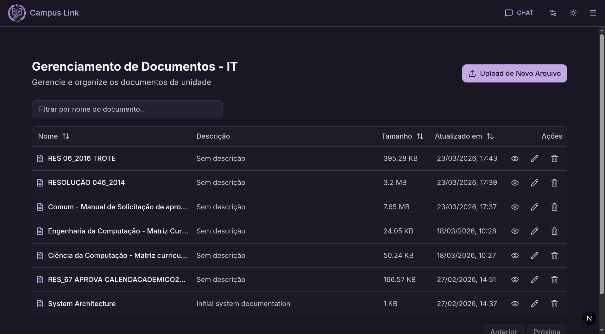
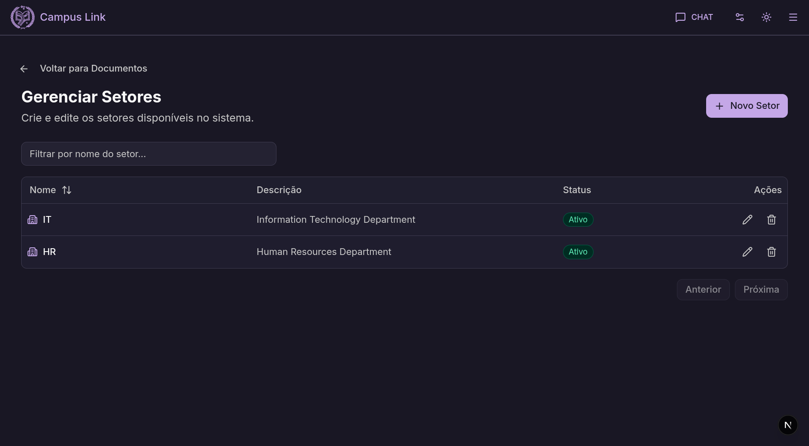
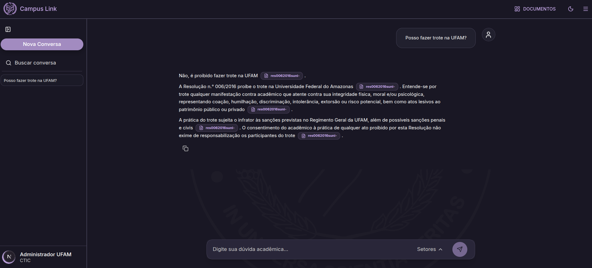
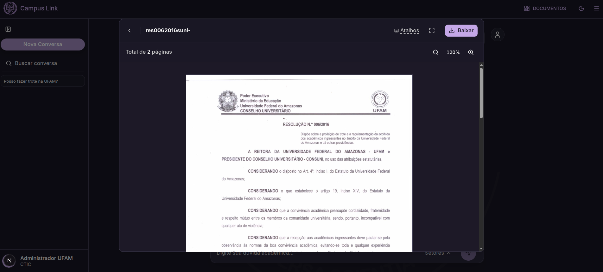

# CampusLink

CampusLink é uma aplicação de chatbot de informações acadêmicas utilizando técnica de RAG desenvolvido para a Universidade Federal do Amazonas como projeto final da formação [Web Academy](https://www.webacademy.icomp.ufam.edu.br/). O site foi desenvolvido por uma equipe de 4 alunos no decorrer de 3 meses. As informações dos demais membros da equipe se encontram na página de portfólios da formação: [Portifólios](https://www.webacademy.icomp.ufam.edu.br/portfolio)

Este é um repositório público com capturas de tela do portal CampusLink. O  código da aplicação em si não se encontra aqui, pois no momento em que escrevo este texto, a propriedade da aplicação pertence à Capacitação Web Academy.

## Resumo das tecnologias utilizadas

Front-end: Next.js, TailwindCSS, React, e Zod.

Back-end: Express.js, Swagger, Axios, Prisma, LlamaIndex e Docling.

## Capturas de tela

### Página inicial

### Página de Login

### Listagem de documentos de um usuário

### Gerenciamento de setores da universidade

### Resposta do Chat

### Visualização de fonte da resposta

